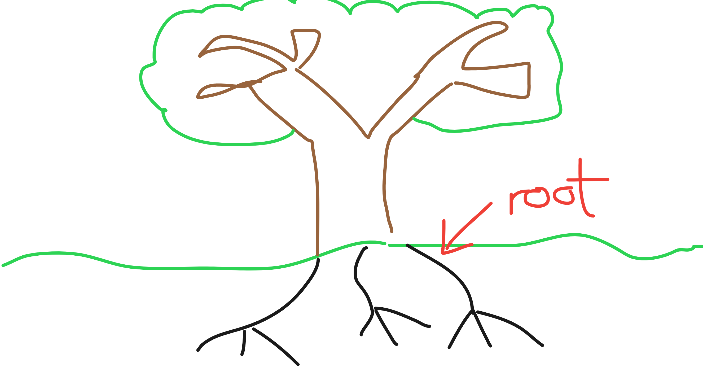
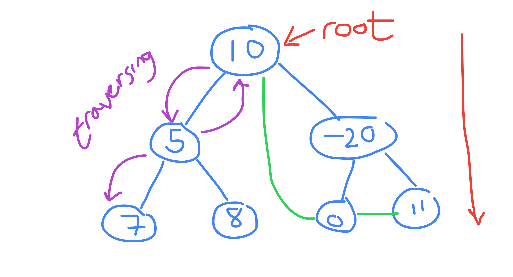
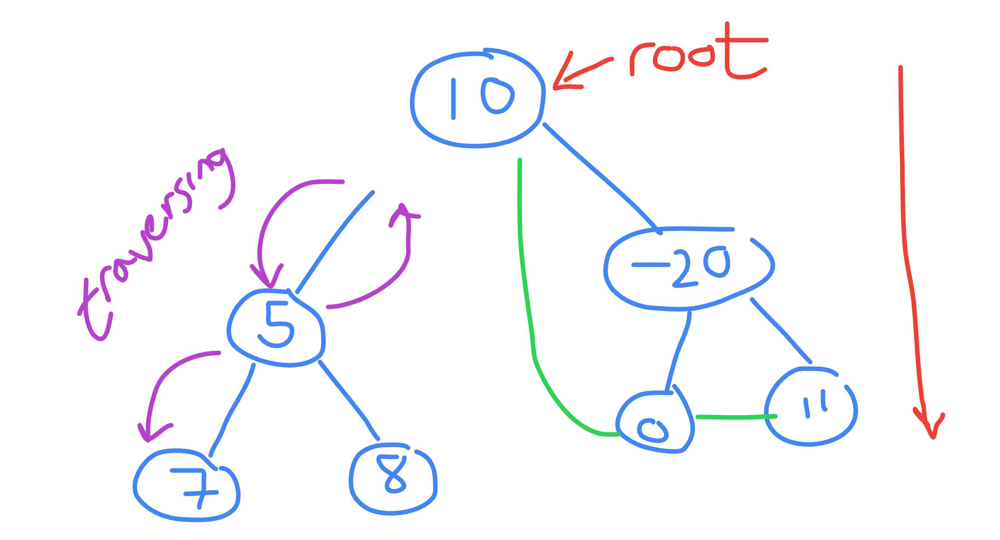
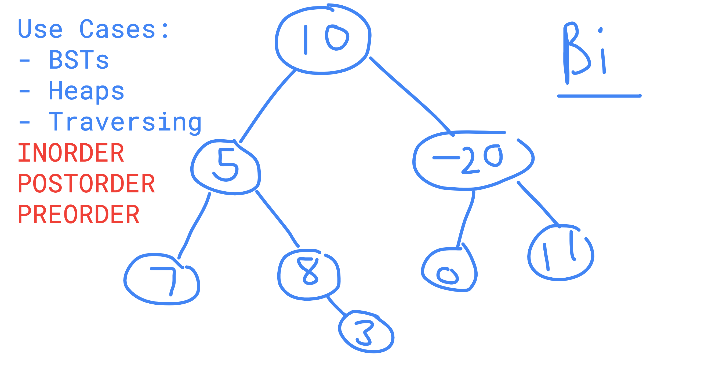

# Visualisations

### Real-Life Tree Diagram
The diagram below explains the conceptual side to the tree data structure. 
if you think about how a real-world tree sustains itself as a flow, you know that this is through the **root**. 
This is where the tree stems from, how this tree comes to be, and this concept follows through to the data  structure.

### Tree Features
A tree is made up of nodes arranged in a hierarchy.
There are five main features of a tree which are shown on the diagram below:
1. The root (or head) is the first element in a tree
2. All other nodes will have just one parent
3. Are able to *traverse* (a fancy way of saving move around) between a parent and child node 
and also vice versa
4. Directional, trees work top-to-bottom
5. Acyclic, trees can't have any cycles (as shown by the green lines). If a loop can happen between a group of nodes, 
for example 10 -> -20 -> 0 -> 10, then it is **not a tree**

### 1 Extra Feature
Another distinct feature of a tree is it needs to be connected. The following diagram would not be classified as a tree.

### Use Cases
The tree we have been showing is an example of a Binary tree. Trees are described using K-ary, 
where K is the maximum number of child nodes. Binary trees where k == 2 means that the tree has a maximum of 2 nodes. 
Nodes can be childless (like 7) have one child (like 8) or have two (like 5) and this would still be a binary tree.

Binary Trees have quite a few use cases. A famous application is Binary Search Trees where you have a sorted tree and 
can efficiently find data. You can also use trees to implement Heaps.

Another key use case is traversing in a direction through data, a common coding interview problem is the implementation 
of traversal - inorder, preorder and postorder. These are just the three most common ways to traverse around a whole 
tree - you do not need to know this for this course but if ever these terms come up, know they are referencing the order
in which data is fetched from a tree.

-----------
## ⛓️ More Links

1. [Binary Tree Data Structure](https://www.geeksforgeeks.org/binary-tree-data-structure/)
2. [Further Reading: Tree Traversals | Inorder, Preorder, Postorder](https://www.geeksforgeeks.org/tree-traversals-inorder-preorder-and-postorder/)

