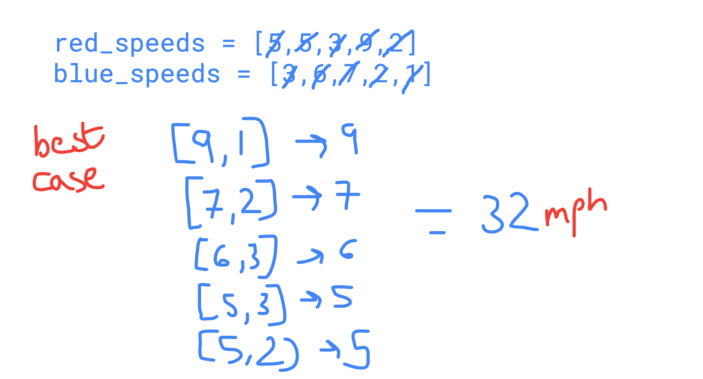
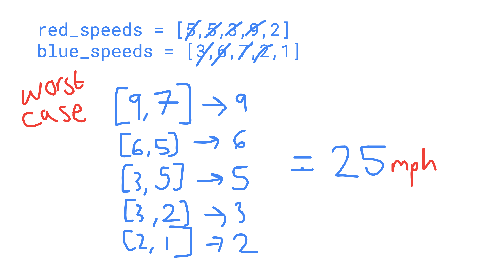
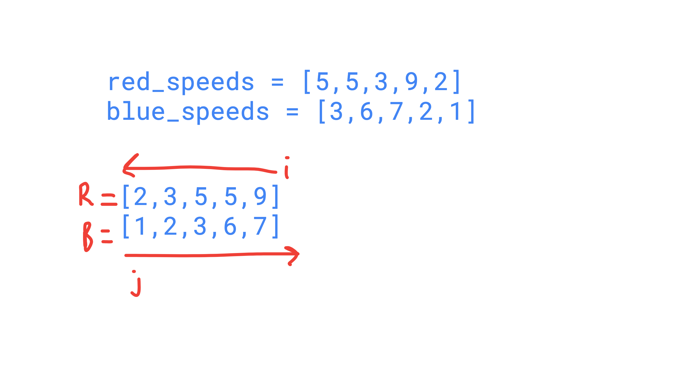
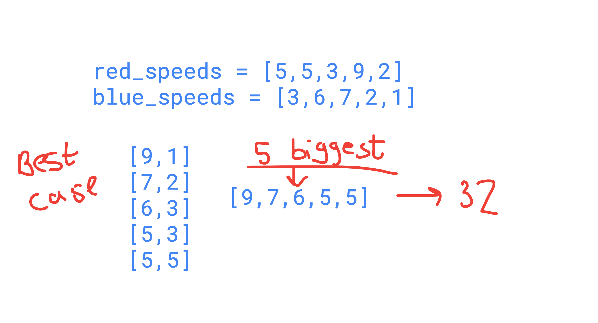

## 📄 The Problem
Write a function that returns the maximum possible OR the minimum possible TOTAL SPEED  of ALL TANDEMS being ridden.

The indication of max or min speed will be  based on an input param ‘fastest’. If ‘fastest = true’, then return max 
total  speed or vice-versa.

You are given two lists of integers. Both lists have the same length. First list represent speeds of riders who wear
blue shirts and list two represents speeds of riders in red shirts. The number of blue riders equals the number of 
red riders. 

Each bicycle needs to be ridden by two people: one in red and the other one in blue shirt!

### EXAMPLE

##### INPUT
red_speeds = [5,5,3,9,2]
blue_speeds = [3,6,7,2,1]
fastest = True

#### RESULT
speed = 32
> The fastest possible total speed of all tandems

-----------

## 🎨️ Problem Visualisation
Before you begin coding, sketch out the problem by hand using any example inputs and outputs, are there any patterns or shortcuts you can identify?

So by hand, we can figure out the best case:

This tells us that we need to pair the maximum values with a respective minimum value in the other list in order to get the optimum result.

By hand, we can also figure out the worst case:

This tells us that to get the slowest speed we need to pair the maximum values with a respective maximum value in the other list in order to lose high speeds.
>N.B. These diagrams have a faux measurement of mph. This is just to make it clear that this value is referring to speed not time. So the higher, the faster.

-----------

## 🎨️ Solution Visualisation
### CFG Solution

- Sorting both lists
- Using indexes go forward or backwards through one of the lists
- Get the maximum value at each index

### Another Solution

- The best case/fastest speed is just the sum of the X biggest speeds, where X is the length of the lists (a shortcut was found which is one of the reasons you would sketch things out before starting)
- The worst case/slowest speed is when both lists are sorted in descending order and we pair the biggest numbers together (to lose other maximum speeds from counting)
-----------
## 🧮 Session Code

```python
"""
🏆 CODING CHALLENGE: TANDEM 🏆
 Write a function that returns the maximum possible OR the minimum possible TOTAL SPEED  of ALL TANDEMS being ridden.

The indication of max or min speed will be  based on an input param ‘fastest’. If ‘fastest = true’, then return max 
total  speed or vice-versa.

You are given two lists of integers. Both lists have the same length. First list represent speeds of riders who wear
blue shirts and list two represents speeds of riders in red shirts. The number of blue riders equals the number of 
red riders. 

Each bicycle needs to be ridden by two people: one in red and the other one in blue shirt!
"""

# SOLUTION 1 - UTILISING FORWARD-BACKWARD INDEXING
# def tandem_speed(red, blue, fastest):
#     red.sort() <- O(NlogN)
#     blue.sort()  <- O(NlogN)
#
#     if not fastest:
#         reverse_list(red)
#
#     total_speed = 0
#     for idx in range(len(red)):  <- O(N)
#         rider1 = red[idx]
#         rider2 = blue[(len(blue) - idx - 1)]
#         total_speed += max(rider1, rider2)  <- O(1)
#
#     return total_speed
#
#
# def reverse_list(array):  <- O(N)
#     start = 0
#     end = len(array) - 1
#     while start < end:
#         array[start], array[end] = array[end], array[start]
#         start += 1
#         end -= 1


# SOLUTION 2 - HOW I WOULD APPROACH IT
def tandem_speed(red, blue, fastest):
    if fastest:
        total_speeds = red + blue -> O(N)
        total_speeds.sort(reverse=True) -> O(NlogN)
        return sum(total_speeds[0:len(red)]) -> O(N/2)
    else:
        red.sort(reverse=True) -> O(NlogN)
        blue.sort(reverse=True) -> O(NlogN)
        speed = 0
        for i in range(0, len(red)): -> O(N)
            speed += max(red[i],blue[i]) -> O(1)
            print(red[i], blue[i])
        return speed
    
"""
💭 SOLUTION ANALYSIS 💭
Both solutions use the sort() method in python. This has a complexity of O(NlogN).
N.B. You are not expected to know the complexities of inbuilt functions but it is something you should acknowledge will 
add to complexity if this comes up in an interview.

SOLUTION 1: 
- Algorithm Approach: Sorting strings, looping through and accessing indexes in a backwards fashion to create pairs.
- Time Complexity (you can see why this is the breakdown in the function comments)
 O(NlogN + NlogN + N + N + 1 ) therefore ==> O(NlogN), the highest degree
 - Space Complexity 
 O(1) - whilst there are new variables, the length of this is not dependent on the input size
 
SOLUTION 2: 
- Algorithm Approach: If working out the maximum speed, combine lists, sort in descending order and return the sum of
 the biggest elements. Otherwise sort lists, and get the maximum number for each list index.
- Time complexity (you can see why this is the breakdown in the function comments)
If you are going by the fastest time it would be:
 O(N + NlogN + N/2 ) therefore ==> O(NlogN), the highest degree
If you are going by the slowest time it would be:
 O(NlogN + NlogN + N + 1 ) therefore ==> O(NlogN), the highest degree
Therefore it is O(NlogN)
 - Space complexity 
 O(N) - There is a new variable `total_speeds`, which will change its size in memory if the input size changes.
 
🥇 WHICH IS BEST??🥇 
- Both solutions have the same time complexity.
- But Solution 1 has the best space complexity, therefore could be considered the optimal algorithm
- But Solution 2 is a lot more concise (12 lines of code vs 23)
- As always it's a trade off, is there a space constraint or is readability a more important factor for you?

"""

#############################################################

# Test Case 1 -- result 32

# red_speeds = [5, 5, 3, 9, 2]
# blue_speeds = [3, 6, 7, 2, 1]
# fastest = True
#
# print(tandem_speed(red_speeds, blue_speeds, fastest))


#############################################################

# Test Case 2 -- result 25

# red_speeds = [5, 5, 3, 9, 2]
# blue_speeds = [3, 6, 7, 2, 1]
# fastest = False
#
# print(tandem_speed(red_speeds, blue_speeds, fastest))

#############################################################

# Test Case 3 -- result 30

# red_speeds = [1, 2, 1, 9, 12, 3]
# blue_speeds = [3, 3, 4, 6, 1, 2]
# fastest = False
#
# print(tandem_speed(red_speeds, blue_speeds, fastest))

#############################################################

# Test Case 4 -- result 37
#
# red_speeds = [1, 2, 1, 9, 12, 3]
# blue_speeds = [3, 3, 4, 6, 1, 2]
# fastest = True
#
# print(tandem_speed(red_speeds, blue_speeds, fastest))