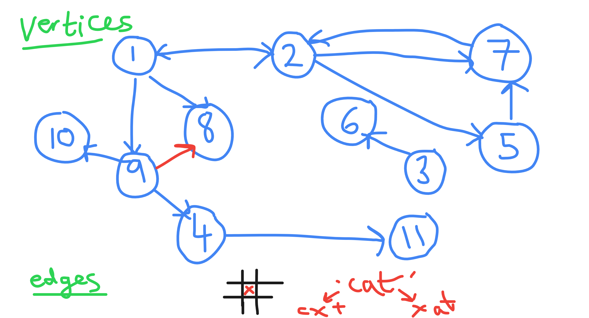
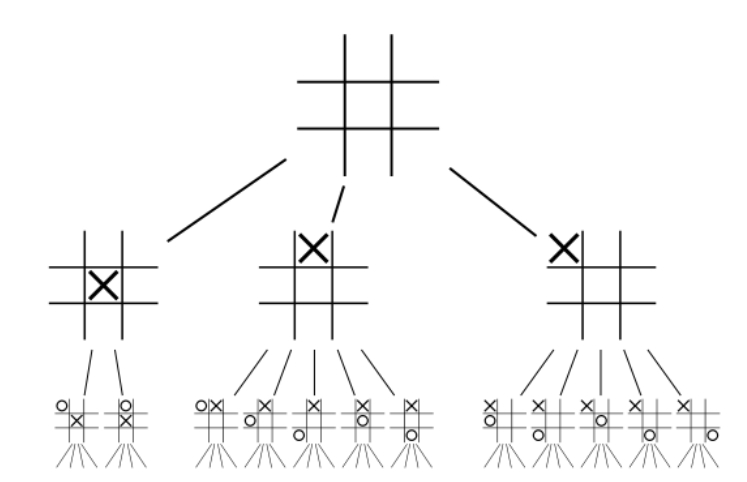

#  Visualisations

### The Anatomy of a Graph

- The definition of a graph is a collection of nodes that may or may not be connected to each other.

- There is some terminology we need to use when we talk about graphs:
  - Values/Nodes are called **vertices**
  - The connection between vertices is called an **edge**. 

- A graph is connected if you can reach any given vertex from any other vertex (known as a path)
- Looking at the diagram above we can see that vertices 3 and 6 are not connected to the other vertices in the graph.
  - They’re still part of the graph but are not connected 
  - This shows us that what we have here is a *disconnected* graph.
- Graphs are used in real-life scenarios everywhere, we’ve all come across it in social media, public transport and more. 
- It is important to note with this graph that edges aren’t notated using a plain line but using an arrow. 
  - This shows direction and how a vertex is connected to another, it means the graph is a directed graph
  - For example you can travel from 1-> 2 but not 2 -> 1. 
  - You can have a straight line in a graph as well that just means it’s an undirected graph so travel can go both ways.
  - An example of a directed graph would be a plane going from one location to another 
  - An example of undirected graphs would be where things are mutual such as becoming friends with someone else on Facebook
- Another thing we can mention here is a concept called a cycle. 
  - A real life example of a cycle is navigating through website links such as Wikipedia where you can get back to where you started.
  - Take 2-7-5 from the diagram. You can travel forever from 2->5->7->2->5->7-....
  - Important to note that this is the case because of the directed edges.
  - If we look at the red arrow connecting 1-9-8, we can see this is **not** a cycle, because 8 doesn't have any edges where it can
move to another node (no arrows directing away from 8). 
- At the bottom of the diagram, you can see a couple of sketches. These are potential use cases of graphs.
  1. Noughts and crosses
       - Every single choice in noughts and crosses is finite and can be mapped
       - For example the first X being in the centre, or on the top left etc.
       - In this case each vertex will hold the data of the current state of the board
       - You can acknowledge that someone putting a X in the top left, then an O in the centre will result in the same board
     as putting an O in the centre first, and X is in the top left.
       - Therefore vertexes would be able to have multiple edges, aka there is more than one path that will cause the same result.
       - Find below another graphic showing how this graph could be structured.

  2. Permutationally swapping
       - This example shows 'cat' and how it can be mapped by a graph by switching letters with 'x'
       - Like with noughts and crosses this can be done as the possibilities are finite.

-----------
## ⛓️ More Links

1. [Graph Data Structure](https://www.geeksforgeeks.org/graph-data-structure-and-algorithms/)
2. [Dijkstra's Algorithm in Python](https://www.bogotobogo.com/python/python_Dijkstras_Shortest_Path_Algorithm.php)

