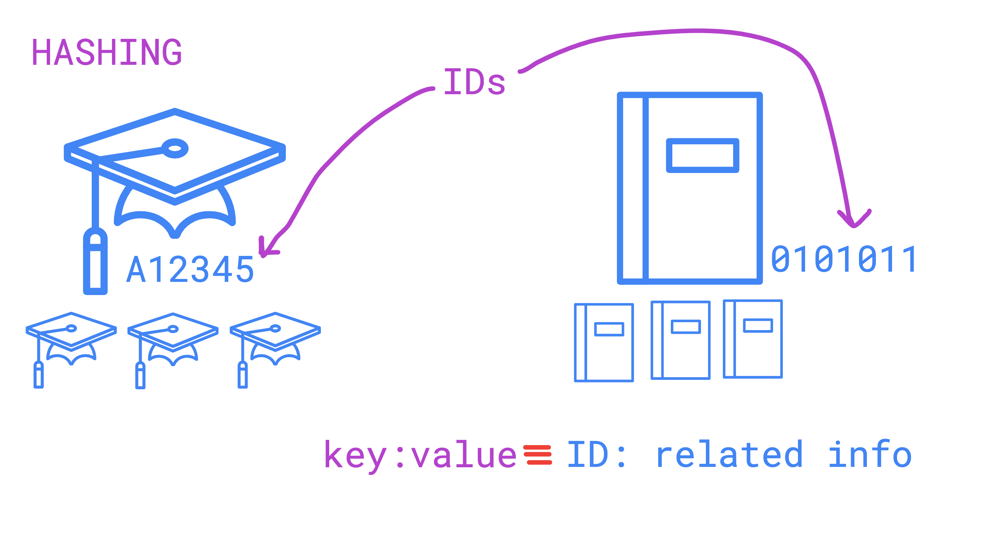
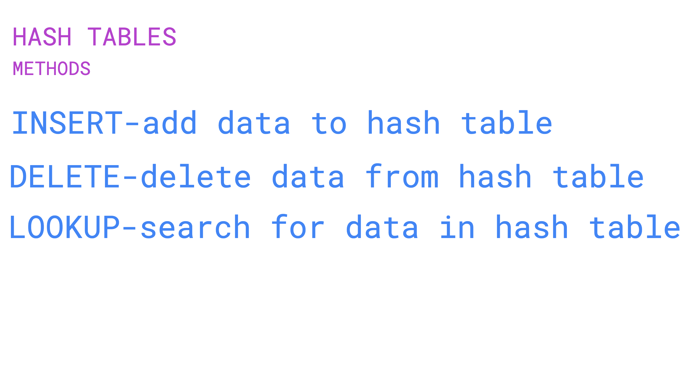
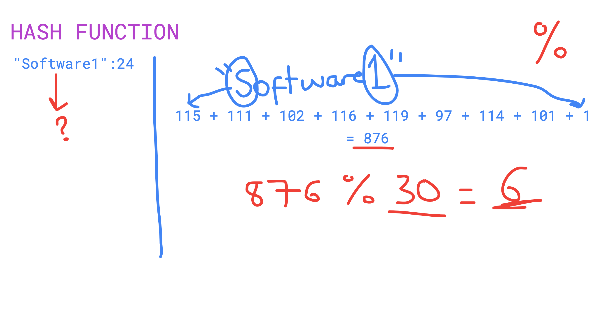
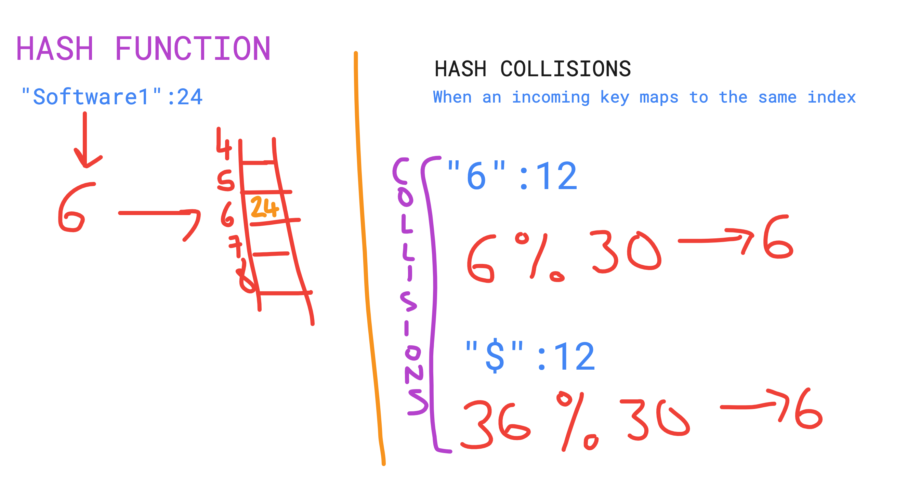
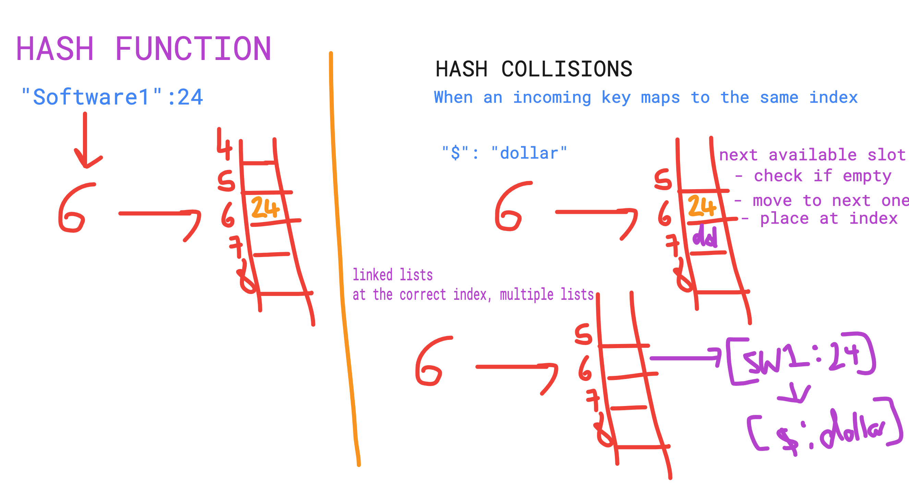

# Visualisations

### ID-Dictionary Mapping
The diagram below shows how the data structure 'dictionary' can be used to implement the relationship between IDs and 
their related data. 

### Hash Table Methods
All the methods you need to have for fully functional hash tables.

### Accessing Values | Lists vs Dictionaries
This diagram shows how keys work under the hood, this is done through list logic and mapping a key to an index. 
This is done through something called a "hash function".

### A Simple Hash Function
Very basic hash function logic that adds all the ASCII characters in the key to get an index value.Modulo logic can be 
added to give a more reasonable and memory-efficient index.

### Hash Functions in Memory & Collision Examples
- On the left, you can see what happens in memory after the hash function - the value is added to a list in the index of the hashed key. 
- On the right, there are examples of other keys that would give the same hashed value. These are examples of hash collisions. 

### Handling Hash Collisions
The right side, shows two ways you can resolve hash collisions:
1. Next Available Slot
   - Index 6 is full so keep moving through the list until there is an empty slot.
2. Linked Lists
   - Restructure the list to instead have Index 6 point to a list of lists. 
   - This means all the keys with the same 
   hash value will still be able to keep their original mapped index.

-----------
## ⛓️ More Links

1. [Sorting with itemgetter](https://siddharth1.medium.com/1-understanding-operator-itemgetter-attribute-or-operator-itemgetter-attribute-27e61754d1fa)

