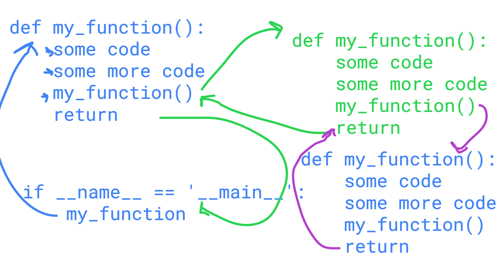
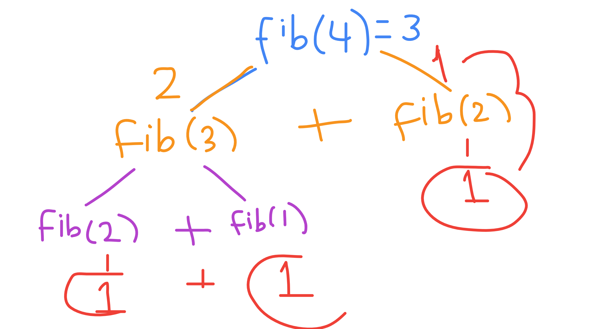
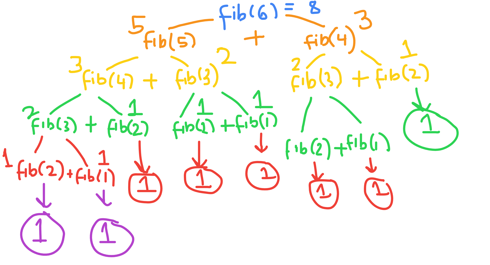

# All The Links 🔗
This file will list links for the session content.

-----------
## 📚 Session Content
🎥 [Recording](https://www.dropbox.com/s/01e1tx0s0ii7wpl/Software%20Session%2011%20%7C%20Recursion.mp4?dl=0)
⬜ [Slides](https://docs.google.com/presentation/d/1nzxBYxObysgIQyqpL0-gx3rD4cZk4LXv/edit?usp=sharing&ouid=104286726783686080248&rtpof=true&sd=true)

-----------
## 🎨️ Visualisations

### Recursive Function
The diagram below shows a recursive function and how it works by generating multiple instances (or calls) of the function. 
The 'return' keyword is what ends the current call and the value is returned to where it was called from. 
Once it gets back to the original call the recursion is complete.

### Fibonacci Recursion | Part 1
Shows the recursion tree for the case when you're passing 4 into the fib function. The recursive calls take two 
paths - following the fibonacci sequence formula:
> F(n) = F(n-1) + F(n-2)

Circled numbers denote when a base case has been found in a recursive call. If a base case has not been found the 
recursion continues, one branch doing fib(n-1) and the other fib(n-2). The base case will see a value returned, 
this will be passed to the last element on the call stack allowing for the necessary addition to occur. 

Eventually the original two recursive calls will know their value ==> fib(4) will know it is the sum of 2 and 1.

### Fibonacci Recursion | Part 2
Shows the recursion tree for the case when you're passing 6 into the fib function. Again the recursive calls take two 
paths - following the formula. This example was chosen to show a deeper recursion depth showing the impact of a higher 
number being passed into the fibonacci function.

Circled numbers denote when a base case has been found in a recursive call. If a base case has not been found the 
recursion continues, one branch doing fib(n-1) and the other fib(n-2). The base case will see a value returned, 
this will be passed to the last element on the call stack allowing for the necessary addition to occur. 

Eventually the original two recursive calls will know their value ==> fib(6) will know it is the sum of 5 and 3.

-----------
## ⛓️ More Links

- [Python Function Recursion](https://www.w3schools.com/python/gloss_python_function_recursion.asp#:~:text=Python%20also%20accepts%20function%20recursion,data%20to%20reach%20a%20result.)