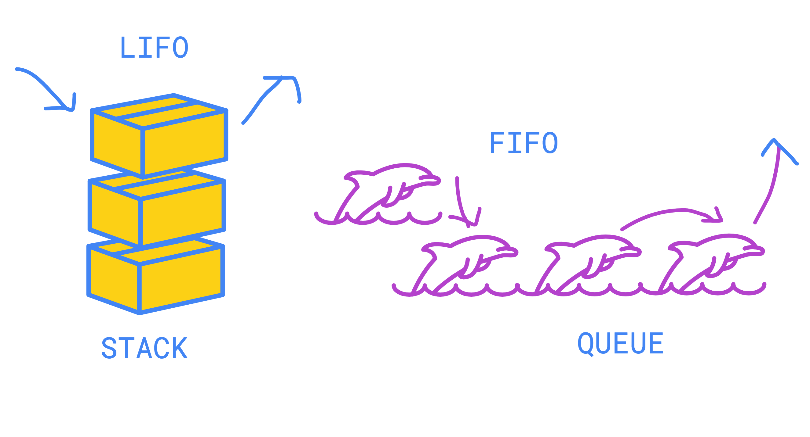

# Visualisation

### FIFO vs LIFO

### \_\_init__ Visualisation
The diagram below shows what is happening in memory when calling the initialisation function for a stack. 
A similar structure can be seen with queues.

-----------
## ⛓️ More Links

1. [Stacks and Queues in Python](https://stackabuse.com/stacks-and-queues-in-python/)
2. [FIFO vs LIFO](https://devdojo.com/tnylea/fifo-vs-lifo-in-programming)

