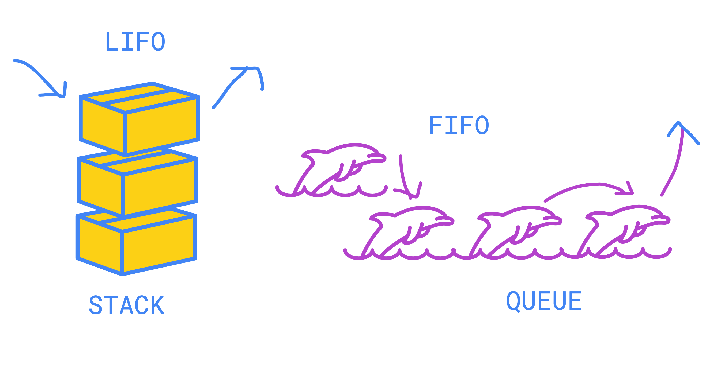
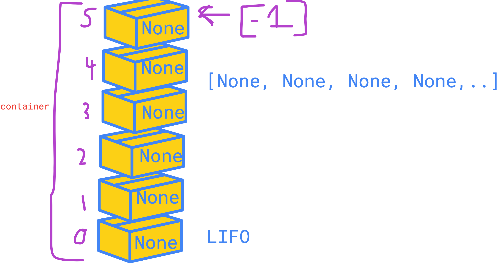

# All The Links 🔗
This file will list links for the session content.

-----------
## 📚 Session Content
🎥 [Recording](https://www.dropbox.com/s/cvi0dmytwby5k40/Software%20Session%209%20%7C%20Stacks%20%26%20Queues.mp4?dl=0)
⬜ [Slides](https://docs.google.com/presentation/d/16UGrj24vWWkeO6EOUvwNM4xCGzxlXcae/edit?usp=sharing&ouid=104286726783686080248&rtpof=true&sd=true)

-----------
## 🎨️ Visualisation

### FIFO vs LIFO

### \_\_init__ Visualisation
The diagram below shows what is happening in memory when calling the initialisation function for a stack. 
A similar structure can be seen with queues.

-----------
## ⛓️ More Links

1. [Stacks and Queues in Python](https://stackabuse.com/stacks-and-queues-in-python/)
2. [FIFO vs LIFO](https://devdojo.com/tnylea/fifo-vs-lifo-in-programming)

